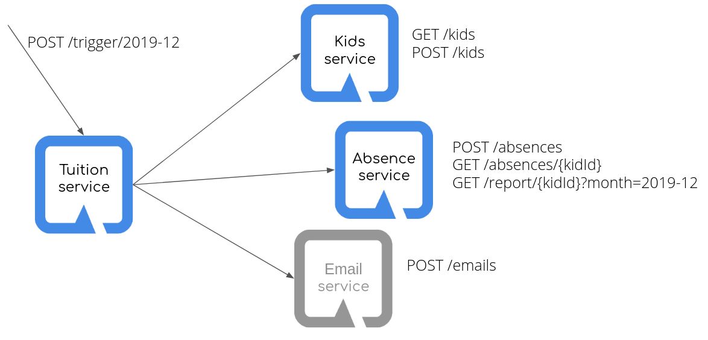

# Kindergarten system

The task is to implement a system for kindergarten tuition calculation.

The system will comprise of:
- kids service for storing children data
- absence service for storing when a child was absent
- tuition service for calculating the tuition for a given month
- email service for sending email notifications.

The tuition service will get a list of kids from kids service.
For each kid, it will get a list of their absences from absence service, 
prepare a message with the tuition amount and send it to the kid's parents
using the email service.

The email service is already provided, you can find it in the `mails` directory in this repository.

To query the rest services, you can use `curl` or a browser extension, such as Advanced REST client for Chrome.




## 1. Implement the system
All the services store their data in memory.

All the services should produce and consume data in the `JSON` format.

Use:
- JAX-RS to expose REST services, 
- [MicroProfile Rest Client](https://download.eclipse.org/microprofile/microprofile-rest-client-1.3/microprofile-rest-client-1.3.html#_sample_builder_usage) to access REST resources,
- `application.properties` and `@ConfigProperty` for configuration
- `quarkus.http.port` property (in `application.properties`) to specify a non-default port for a service
    - helpful to run the services together locally
- a `quarkus-resteasy-jsonb` extension for json support in JAX-RS 
    
Important commands:
- generating a project 
```
mvn io.quarkus:quarkus-maven-plugin:<quarkus-version>:create
```
- listing available extensions: 
```
mvn quarkus:list-extensions
```
- adding extensions: 
```
mvn quarkus:add-extension -Dextensions=<comma-separated list of extensions>
```
- starting in the dev mode:
```
mvn clean compile quarkus:dev
```
- building a native binary:
```
mvn clean package -Dnative -Dnative-image.docker-build=true
```
 

### Kids service
A CRUD application that stores children data.

For the local run, expose it on port `8081`.

#### API

##### `GET /kids`
#TODO: reference Kid and Parent classes from Feeder

Response: status code `200`
```JSON
[
{
  "id": 1,
  "firstname": "Janek",
  "lastname": "Kowalski",
  "parents": [
    {
      "firstname": "Jan",
      "lastname": "Kowalski",
      "email": "jan.kowalski@example.com"
    },
    {
      "firstname": "Janina",
      "lastname": "Kowalska",
      "email": "janina.kowalska@example.com"
    }
  ]
},
{
  "id": 2,
  "firstname": "..."
}
]
```


##### `POST /kids`

Request:
```JSON
{
  "firstname": "Janek",
  "lastname": "Kowalski",
  "parents": [
    {
      "firstname": "Jan",
      "lastname": "Kowalski",
      "email": "jan.kowalski@example.com"
    },
    {
      "firstname": "Janina",
      "lastname": "Kowalska",
      "email": "janina.kowalska@example.com"
    }
  ]
}
```
Response: status code 201
```JSON
{
  "id": 1,
  "firstname": "Janek",
  "lastname": "Kowalski",
  "parents": [
    {
      "firstname": "Jan",
      "lastname": "Kowalski",
      "email": "jan.kowalski@example.com"
    },
    {
      "firstname": "Janina",
      "lastname": "Kowalska",
      "email": "janina.kowalska@example.com"
    }
  ]
}
```

### Absence service
#TODO: reference Absence class from Feeder

A service that stores kids' absences.
It stores and exposes single absences but also provides a monthly report of absences for a child. 

For the local run, expose it on port `8082`

#### API

##### `POST /absences`
Request:
```JSON
{
  "kidId": 1,
  "date": "2019-01-31"
}
```
Response: status code `201`

##### `GET /absences/{kidId}` 
Response:
```JSON
[
{
  "kidId": 1,
  "date": "2019-01-31"
},{
  "kidId": 1,
  "date": "2019-01-11"
}
]
```
Response: status code `200`

##### `GET /report/{kidId}?month=2019-05`

Response: status code `200`
```JSON
{
  "kidId": 1,
  "daysAbsent": 5
}
```


### Tuition service
For each child, calculates the amount of money to pay for the kindergarten.
Then sends an email (via e-mail service) to parents.

Please note that the email service is not reliable.
Use [MicroProfile Fault Tolerance's `@Retry`](https://download.eclipse.org/microprofile/microprofile-fault-tolerance-2.0/microprofile-fault-tolerance-spec.html#_retry_usage)
to make sure the message is sent. 

The formula to calculate the tuition:
```
max(200, 500 - daysAbsent * 20)
```

#### API:

##### `POST /trigger/2019-05`

Triggers calculations and sending emails.

Response: status code `200`

### [Already provided] Email service

To run the email service, enter the `mails` directory, build the project
and run:
```
java -jar target/mails-1.0-SNAPSHOT.jar
```

It will expose a web page listing all the messages sent and an API described 
below at http://localhost:8084

#### API
`POST /emails`
Request:
```JSON
{
  "address": "jan.kowalski@example.com",
  "subject": "Your kindergarten tuition for Janek",
  "content": "In the previous month, your child was absent for 14 days and your tuition is 220 PLN"
}
```

Response: status code: `201`

## 2. Populate the system
This repository contains a `feeder` application that lets you easily feed the system with some data.

To run it, either run the `Feeder` class in an IDE or build the app with 
`mvn clean package` and run the produced shaded jar:
```
java -jar target/feeder.jar
```

`feeder` assumes the applications are running locally on the suggested ports.
If you used different ports or want to feed applications running in minikube, 
make sure to set `kids.uri` and `absence.uri` system properties to 
appropriate URLs, e.g.:
```
java -Dkids.uri=http://localhost:8181 -Dabsence.uri=http://localhost:8080 -jar target/feeder.jar
``` 

## 3. Trigger the calculations and watch the results
Open your browser on the email service. By default it is exposed at http://localhost:8084

Trigger the calculations, e.g.:
```
curl localhost:8080/trigger -d '{"year": 2019, "month": 12}'
```

If the calculations finish successfully, the mail service page 
will show the emails sent to parents.

## 4. Add monitoring
### OpenApi
Expose OpenApi documentation by simply adding `quarkus-smallrye-openapi` extension to 
each of your applications.

Query the `/openapi` endpoints to see get the information.
By default the documentation is exposed in the YAML format. If you wish to get it in the JSON
format, add an `Accept` header set to `application/json`

### Metrics
Similarly to OpenApi, Metrics can be added to your application by simply adding 
`quarkus-smallrye-metrics` extension.
The metrics are exposed on the `/metrics` endpoint, by default in the Prometheus format. 
If you wish to view them in JSON, add an appropriate header to the request.

Take a special look at the application metrics for the tuition service.
You should find metrics for `@Retry` there.

### Distributed tracing
Distributed tracing requires a bit more work to set up.
First you need to add the `quarkus-smallrye-opentracing` extension.
Then, configure it in `application.properties`.
Below are the example settings for emails application. 
```properties
quarkus.jaeger.service-name=emails
quarkus.jaeger.sampler-type=const
quarkus.jaeger.sampler-param=1
quarkus.jaeger.endpoint=http://localhost:14268/api/traces
```

To actually collect the metrics you need to run Jaeger. 
The simplest way to do it is to use a Docker image:
```bash
docker run -e COLLECTOR_ZIPKIN_HTTP_PORT=9411 -p 5775:5775/udp -p 6831:6831/udp -p 6832:6832/udp -p 5778:5778 -p 16686:16686 -p 14268:14268 -p 9411:9411 jaegertracing/all-in-one:latest
```

If you'd like to run it in Kubernetes, you can use:
```bash
kubectl create -f https://raw.githubusercontent.com/jaegertracing/jaeger-kubernetes/master/all-in-one/jaeger-all-in-one-template.yml
``` 

## 5. Deploy the services to minikube
[Instructions for installing minikube, building Docker images and using kubectl](https://github.com/michalszynkiewicz/simple-kubernetes-cheat-sheet)

Install minikube and start it.

Following the instructions linked above, build docker images for the four applications
and push them to minikube's docker registry.

Create deployments for each of the applications.

Create kubernetes services for each of the applications. 
Use `NodePort` to be able to access the from outside of the cluster. 

Assuming your services are called `kids`, `absence` and `mails` and are exposing 
the suggested ports, create a `ConfigMap` as follows:

```yaml
kind: ConfigMap
apiVersion: v1
metadata:
  name: kindergarten-config
data:
  kids.url: 'http://kids:8081'
  absence.url: 'http://absence:8082'
  mails.url: 'http://mails:8084'
```

And add propagate the tuition's environment from it:
```
kubectl set env deployment tuition --from=configmap/kindergarten-config
```

Execute `Feeder` with urls of the services.

Trigger the calculations again, this time in the Kubernetes version, and observe 
the web page of the kubernetes version of mail service.

## 6. TODO Bonus Tasks (IDEAS)

- Create tests for your rest endpoints
- Build native images for your microservices using docker
